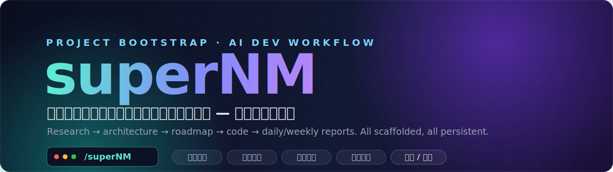

<div align="center">



<h1>🚀 superNM</h1>

<p><b>一条命令，从零到可立即开发、可持续交付的完整项目工程体系。</b></p>

<p>
不是生成几行模板代码就完事 —— 而是产出
<b>产品调研 · 技术架构 · 开发计划 · 项目骨架 · 开发规范 · 日报周报</b>
一整套可落地、可交付、可持续的工程体系。
</p>

<p>
<a href="https://opensource.org/licenses/MIT"></a>


</p>

<p>
<a href="#-快速开始">快速开始</a> ·
<a href="#-9-个阶段一气呵成">工作流</a> ·
<a href="#-为什么不是简单的脚手架">为什么</a> ·
<a href="#-日报周报体系">日报周报</a> ·
<a href="#️-路线图">路线图</a>
</p>

</div>

---

## 💡 它解决什么问题

开新项目最累的从来不是写第一行代码，而是**写代码之前的所有事**：调研竞品、定技术栈、拆开发计划、立项目规范、搭目录、配 Git、还要应付周报日报。

`superNM` 把这一切交给你的 AI 编程助手一次完成 —— 让你的新项目从 **「空目录」→「可立即开发的工程体系」** 只需要 5 分钟。

```
你的想法  ──▶  /superNM  ──▶  完整项目工程体系
```

---

## 🎯 适合谁用

| 角色 | 场景 | 痛点 |
|------|------|------|
| **独立开发者** | 一个人从零搭建 SaaS / 工具产品 | 没人讨论技术方案，从调研到编码全自己扛 |
| **个人业务线负责人** | 公司里独立负责一条业务线，前后端都要做 | 项目结构、开发规范、日报周报全要从头建 |
| **小团队技术负责人** | 公司新启项目，需要把规范立起来 | 不想每次开新项目都手动拷旧项目的脚手架 |
| **AI 编程重度用户** | 用 AI 编程助手写代码（Cursor / Copilot 等） | 希望 AI 记住项目规范，每次会话一致行动 |

---

## ⚡ 快速开始

```bash
# 1) 安装（项目级，推荐）
mkdir -p .claude/skills
git clone https://github.com/XuJWood/superNM.git /tmp/supernm
cp -r /tmp/supernm/skills/supernm .claude/skills/ && rm -rf /tmp/supernm

# 2) 进入你的空项目目录
cd ~/Projects/my-new-product

# 3) 在 AI 助手会话里调用
#    带项目名：
/superNM my-awesome-product
#    或不带参数，进入交互式收集：
/superNM
```

<details>
<summary>📺 交互示例（点开看）</summary>

```
助手：你好！让我们来启动这个新项目，先问你几个问题：

1. 产品方向 —— 你要做什么产品？（可给描述 / 竞品链接 / 截图）
   > 给宠物医生的 AI 问诊辅助工具
2. 目标用户是谁？
   > 宠物医院的医生
3. 最重要的 3-5 个功能？
   > 症状→诊断建议、用药方案推荐、病例自动整理、主人端健康报告
4. 技术偏好？（默认按产品方向推荐）
   > Python + FastAPI
5. 需要前端界面吗？
   > 需要，医生后台 + 主人端页面

[助手开始 WebSearch 调研竞品、生成调研报告、拆 ROADMAP、搭骨架...]
```

</details>

---

## 🧭 9 个阶段，一气呵成

| 阶段 | 做什么 | 产出 |
|:--:|------|------|
| **1** 产品方向收集 | 交互式收集想法（支持链接 / 截图 / 文档） | — |
| **2** 产品调研 | WebSearch 竞品分析 + 技术方案对比 | `docs/Product-Report.md` |
| **3** 开发计划 | 按**阶段**划分，不绑死时间，每阶段带验收标准 | `ROADMAP.md` |
| **4** 前端界面规划 | 确认页面需求，衔接 `/frontend-design` 生成 UI | `docs/Frontend-Design-Spec.md` |
| **5** 项目骨架 | 依调研选型动态生成目录与入口（不预设技术栈） | 源码骨架 |
| **6** 开发规范 | 生成每次会话自动加载的开发基线 | `CLAUDE.md` |
| **7** 日报周报体系 | 开发日志 + 日报/周报模板 + 触发时机 | `devlog.md` `reports/` |
| **8** Git 初始化 | `git init` + 首次规范化 commit | 版本库 |
| **9** 输出总结 | 完整项目树 + 下一步建议 | — |

### 输出的项目结构

```
my-project/
├── CLAUDE.md                       # 开发基线（每次会话自动加载）
├── ROADMAP.md                      # 分阶段开发计划
├── devlog.md                       # 开发日志（每次会话追加）
├── .gitignore
├── .claude/settings.json           # 项目级配置
├── src/                            # 源码（目录由 ROADMAP 决定，语言由选型决定）
│   └── ...                         # 入口与模块根据产品调研生成
├── config/                         # 配置文件（按需）
├── docs/
│   ├── Product-Report.md           # 产品技术调研报告
│   ├── Architecture-and-Dev-Standards.md
│   └── Frontend-Design-Spec.md     # 前端设计规格
├── reports/
│   ├── _模板.md  _日报模板.md      # 周报 / 日报模板
│   └── daily/                      # 日报存档
├── tests/  scripts/  web/          # 测试 / 脚本 / 前端（如有）
```

> 🧬 **架构由调研和计划驱动，不预设特定技术栈** —— Python/FastAPI、Node.js/Express、Go/Gin 均可按需生成。

---

## 🔥 为什么不是简单的脚手架？

| 普通脚手架 | superNM Skill |
|------------|---------------|
| 固定目录结构 | 根据你的产品定制目录 |
| 没有技术调研 | 自动竞品分析 + 技术选型 |
| 没有开发计划 | 分阶段、带验收标准的 ROADMAP |
| 没有开发规范 | `CLAUDE.md` 规范每一次会话 |
| 没有汇报体系 | 日报 / 周报 / 开发日志全线打通 |
| 拷完就忘 | 每次会话自动加载项目规范，行动一致 |

---

## 🧩 技术栈适配

不带技术偏见，**根据产品方向和需求推荐最合适的方案**：

| 后端 | 前端 | AI 部分 |
|------|------|---------|
| Python / FastAPI | 纯 HTML/CSS/JS | LangGraph |
| Node.js / Express | React / Vue / Next.js | OpenAI / Anthropic SDK |
| Go / Gin | 调用 `/frontend-design` | LangChain |
| 按需生成 | 按需生成 | 按需选型 |

---

## 📋 日报/周报体系

核心差异化能力之一 —— 初始化时自动建立完整的时间汇报体系。

**触发时机**

| 文档 | 何时生成 | 存放位置 |
|------|---------|---------|
| **devlog.md** | 每次开发完成立即追加 | 项目根目录 |
| **日报** | 每天最后一次会话结束 | `reports/daily/2026-06-04.md` |
| **周报** | 每周日 18:00 后 / 周一开工前 | `reports/week-03-0608.md` |

**会话自动检查** —— 每次新会话启动时，AI 助手会先：① 检查昨天是否缺日报 → 提示补上；② 检查上周是否缺周报 → 提示生成；③ 然后才开始今天的开发。

> 再也不用被催「周报发一下」，也不用周末加班补周报 —— 从 devlog 自动汇总。

---

## 🔗 配合使用的 Skills

| Skill | 用途 |
|-------|------|
| `/frontend-design` | 开发前端时自动调用，生成高质量 UI 代码 |
| `superpowers` | 多 Agent 协作，调研 / 分析阶段并发加速 |

---

## 📖 设计哲学

来自真实项目的踩坑经验，五条核心理念：

1. **每次会话可复现** —— `CLAUDE.md` 保证 AI 每次都知道项目全貌
2. **配置驱动，不硬编码** —— 节点 / 工具 / 配置尽量通过 YAML 注册
3. **每阶段有验收标准** —— 不做「不确定做完没」的开发
4. **汇报体系自动化** —— 不专门花时间写周报，从 devlog 汇总
5. **前后端同步演进** —— 不先做后端再补前端

---

## 🗺️ 路线图

- [x] Phase 1–9 全流程项目初始化
- [x] 日报 / 周报模板 + 触发时机规范
- [ ] 更多后端模板（Express / Go / Gin）
- [ ] 数据库迁移脚本集成（Alembic / Prisma）
- [ ] CI/CD 与 Docker Compose 一键部署模板

---

## 🤝 贡献

这是给独立开发者和个人业务负责人的工具。有好的想法或模板，欢迎 [提 Issue](https://github.com/XuJWood/superNM/issues) 或 PR。

## 📄 License

[MIT](LICENSE) —— 随便用，随便改，随便发给别人。

<div align="center"><sub>用 ❤️ 打造 · 如果对你有用，点个 ⭐ 支持一下</sub></div>
